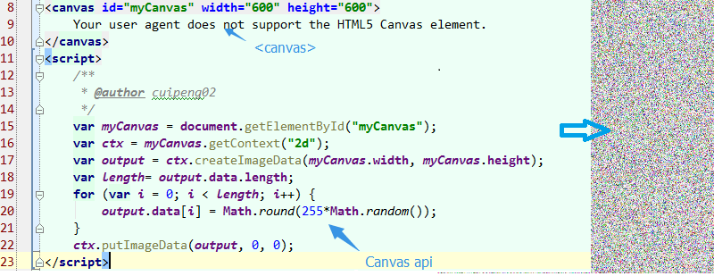

@s
## Canvas入门与拓展
 
author: 崔鹏
 
date: 2015-03-08

@s
## 题要
 
### 一、 HTML5背景介绍
### 二、 CANVAS简介
### 三、 准备知识：数学知识&物理原理
### 四、 CANVAS基础API
### 五、 扩展1：Demo示例
### 六、 扩展2：个人小制作
@vs
## HTML5背景介绍
###1-1 什么是HTML5？
个人认为，HTML5可以是一个比较广义的概念，代表了当前新形势下的web领域一大波新技术的集合。
我感觉至少包含以下几类技术：

    1.狭义的HTML5。这块包含的技术点比较多，是H5开发大头，也是基础要求。
    2.CSS3。这块包含的技术点比较多，是H5开发大头，也是基础要求。
    3.网络通信，包含http2.0，xhr2.0，webrtc，websocket等最新的通信技术标准。
    4.多媒体。不用安装插件即可支持播放音视频，同时可与CSS无障碍配合。
    5.图形编程（canvas,svg,webGL）,支持2d/3d绘图能力。js直接调用opengl es 2.0 api。
    6.新的渲染引擎（webkit）与js虚拟机运行原理，性能强劲。
    7.最新ECMAScript 6语言规范，从语言层面进行了重构与增强。
        参见:http://javascript.ruanyifeng.com/advanced/ecmascript6.html
    8.本地缓存localstorage，甚至本地数据库技术IndexedDB,webSQL等。
    9.WEB组件化，widget开发将更加规范，提高可复用性，避免重复造轮子。
@vs
    10.Device API，实现各种人机交互硬件需求，如语音，摄像头，gps等。

        人脸识别demo:http://neave.github.io/face-detection/
        手势识别demo:http://www.webhek.com/misc/gestures-reveal-js
    11.File API，提供对本地文件的操作支持。
    12.前端架构、前端设计模式、WebAPP规范、前端性能规范、前端模块化规范、前端适配。
    13.前端工程化实践。如再用的有百度fis,grunt等
    14.node编程。使JS具备了本地编程和服务端编程的能力。
    15.多线程webworker技术。。。等等各种新技术和新思想，等你去发现。
    （注：HTML5作为HTML4的增强，自然也包含了原HTML4的相关技术，但不在此介绍范围内）。

@s
###1-2 发展情况
简单搜索了几则新闻摘录如下：

    1.Google今起将自动转换Flash广告为HTML5版本
    2.YouTube视频将默认使用HTML5迁移Flash技术
    3.Apple开放js加速引擎Nitro，重视iOS设备上HTML5的表现。
    4.得益于WEB优良的跨平台性，很多电视，车载系统，家用电器等嵌入式领域也在用HTML5技术开发实现
        如海信在SINOCES2013展出HTML5概念电视,KT（韩国电信）实现了基于HTML5的智能IPTV等。
        系统只需要支持WEB技术，就能够轻易运行众多WEB应用，企业成本降低了很多，而且方案足够简单。
    5.大量的HTML5游戏涌现，如神经猫一款小游戏短时间内就聚集了大量人气。
    6.前端数据可视化方向。越来越多的BI应用采用HTML5开发， 百度地图API发布HTML5矢量地图渲染引擎；。。。等等

因为它在跨平台支持技术上的完美表现以及软件升级维护方便等固有特点，加之各种规范的逐步落地，互联网各大公司都强调了HTML5技术在下一代产品中的战略地位，积极拥抱HTML5， 对HTML5的发展也起到了很好的促进作用。

@s
##CANVAS简介
###2-1 什么是Canvas?
Canvas是HTML5技术标准中最令人振奋的功能之一，它提供了一套强大的2D图形API，允许脚本语言动态渲染图像。
 
主要由&lt;canvas&gt;元素和Canvas API技术组成：
 
&lt;canvas&gt;是HTML5中新添加的元素类型，决定了在页面布局中的位置，js可以访问到该区域，属于HTML5(狭义的)规范定义的内容。
 
具体的画图API是单独的规范，目前有两种API类型，一种是常见的2D绘图API另一种是支持3D的WebGl技术。
以下如不特别说明，Canvas主要指的是2d绘图API，&lt;canvas&gt;代表具体被绘图的元素。

@s
###2-2 代码印象
个人的理解是，&lt;canvas&gt;是画板，一张白纸，canvas(api)可以理解是绘笔，可随意涂鸦。
&lt;canvas&gt;在html中定义，canvas api在js中实现，如下图所示：

@vs
###2-3 Canvas能干什么？
Canvas非常灵活，能够很好地融合JavaScript代码并在浏览器内绘制华丽的图形。
你可以使用javascript用它来绘制图形、图标、以及其它任何视觉性图像，它也可用于创建图片特效和动画。

@vs
到底，我们能用Canvas做些什么呢？

    1. 游戏：毫无疑问，游戏在HTML5领域具有举足轻重的地位。HTML5在基于Web的图像显示方面比Flash更加立体、更加精巧，运用Canvas制作的图像能够令HTML5游戏在流畅度和跨平台方面发挥更大的潜力。
    2. 图表制作：图表制作时常被人们忽略，但无论企业内部还是企业间交流合作都离不开图表。现在一些开发者使用HTML/CSS完成图标制作，大家完全可以用Canvas来实现。当然，使用SVG来完成图表制作也是非常好的方法。
    3. 动态广告：Flash曾经辉煌的时代，智能手机还未曾出现。现在以及未来的智能机时代，HTML5技术能够在banner广告上发挥巨大作用，用Canvas实现动态的广告效果再合适不过。
    4. 模拟器：无论从视觉效果还是核心功能方面来说，模拟器产品可以完全由JavaScript来实现。
    5. 远程计算机控制：Canvas可以让开发者更好地实现基于Web的数据传输，构建一个完美的可视化控制界面。
    6. 字体设计：对于字体的自定义渲染将完全可以基于Web，使用HTML5技术进行实现。
    7. 图形编辑器：以后的图形编辑器将能够100%基于Web实现。
    8. 其他可嵌入网站的内容：类似图表、音频、视频，还有许多元素能够更好地与Web融合，并且不需要任何插件。
    9. 大家可继续挖掘Canvas的潜力，运用HTML5技术创造更多价值，以上并不代表所有的一切。

@s
##准备知识：数学知识

    求解代数方程
    三角函数
    向量运算
    矩阵计算
    贝塞尔曲线
    坐标系
    几何变换

    其它更高级别的可以研究一下计算机图形学或数字图像技术等书籍，道理都是一样的。
@s
##CANVAS基础API
Canvas API主要包含图形绘制，着色，渐变，文本渲染，图片读取操作等功能，
Canvas画布提供了一个用来作图的平面空间，该空间的每个点都有自己的坐标，x表示横坐标，y表示竖坐标。原点(0, 0)位于图像左上角，x轴的正向是原点向右，y轴的正向是原点向下。
它提供的API足够简单，足够底层，同时足够灵活，如果你掌握了完整的命令，你可以用Canvas创建丰富的WEB应用程序。

@vs
###4-basic-1 绘制路径
beginPath方法表示开始绘制路径，moveTo(x, y)方法设置线段的起点，lineTo(x, y)方法设置线段的终点，stroke方法用来给透明的线段着色。

    ctx.beginPath(); // 开始路径绘制
    ctx.moveTo(20, 20); // 设置路径起点，坐标为(20,20)
    ctx.lineTo(200, 20); // 绘制一条到(200,20)的直线
    ctx.lineWidth = 1.0; // 设置线宽
    ctx.strokeStyle = "#CC0000"; // 设置线的颜色
    ctx.stroke(); // 进行线的着色，这时整条线才变得可见

moveto和lineto方法可以多次使用。最后，还可以使用closePath方法，自动绘制一条当前点到起点的直线，形成一个封闭图形，省却使用一次lineto方法。
@vs
###4-basic-2 绘制矩形
fillRect(x, y, width, height)方法用来绘制矩形，它的四个参数分别为矩形左上角顶点的x坐标、y坐标，以及矩形的宽和高。fillStyle属性用来设置矩形的填充色。

    ctx.fillStyle = 'yellow';
    ctx.fillRect(50, 50, 200, 100);

strokeRect方法与fillRect类似，用来绘制空心矩形。

    ctx.strokeRect(10,10,200,100);

clearRect方法用来清除某个矩形区域的内容。

    ctx.clearRect(100,50,50,50);

@vs
###4-basic-3 绘制文本
fillText(string, x, y) 用来绘制文本，它的三个参数分别为文本内容、起点的x坐标、y坐标。使用之前，需用font设置字体、大小、样式（写法类似与CSS的font属性）。与此类似的还有strokeText方法，用来添加空心字。

    // 设置字体
    ctx.font = "Bold 20px Arial";
    // 设置对齐方式
    ctx.textAlign = "left";
    // 设置填充颜色
    ctx.fillStyle = "#008600";
    // 设置字体内容，以及在画布上的位置
    ctx.fillText("Hello!", 10, 50);
    // 绘制空心字
    ctx.strokeText("Hello!", 10, 100);

fillText方法不支持文本断行，即所有文本出现在一行内。所以，如果要生成多行文本，只有调用多次fillText方法。
@vs
###4-basic-4 绘制圆形和扇形
arc方法用来绘制扇形。

    ctx.arc(x, y, radius, startAngle, endAngle, anticlockwise);

arc方法的x和y参数是圆心坐标，radius是半径，startAngle和endAngle则是扇形的起始角度和终止角度（以弧度表示），anticlockwise表示做图时应该逆时针画（true）还是顺时针画（false）。

下面是如何绘制实心的圆形。

    ctx.beginPath();
    ctx.arc(60, 60, 50, 0, Math.PI*2, true);
    ctx.fillStyle = "#000000";
    ctx.fill();

绘制空心圆形的例子。

    ctx.beginPath();
    ctx.arc(60, 60, 50, 0, Math.PI*2, true);
    ctx.lineWidth = 1.0;
    ctx.strokeStyle = "#000";
    ctx.stroke();

@vs
###4-basic-5 设置渐变色
createLinearGradient方法用来设置渐变色。
createLinearGradient方法的参数是(x1, y1, x2, y2)，其中x1和y1是起点坐标，x2和y2是终点坐标。通过不同的坐标值，可以生成从上至下、从左到右的渐变等等。

使用方法如下：
    var myGradient = ctx.createLinearGradient(0, 0, 0, 160);
    myGradient.addColorStop(0, "#BABABA");
    myGradient.addColorStop(1, "#636363");
    ctx.fillStyle = myGradient;
    ctx.fillRect(10,10,200,100);

@vs
###4-basic-6 设置阴影
一系列与阴影相关的方法，可以用来设置阴影。

    ctx.shadowOffsetX = 10; // 设置水平位移
    ctx.shadowOffsetY = 10; // 设置垂直位移
    ctx.shadowBlur = 5; // 设置模糊度
    ctx.shadowColor = "rgba(0,0,0,0.5)"; // 设置阴影颜色
    ctx.fillStyle = "#CC0000";
    ctx.fillRect(10,10,200,100);

@vs
###4-basic-7 状态保持 save方法，restore方法
save方法用于保存上下文环境，restore方法用于恢复到上一次保存的上下文环境。

    ctx.save();
    ctx.shadowOffsetX = 10;
    ctx.shadowOffsetY = 10;
    ctx.shadowBlur = 5;
    ctx.shadowColor = "rgba(0,0,0,0.5)";
    ctx.fillStyle = "#CC0000";
    ctx.fillRect(10,10,150,100);
    ctx.restore();
    ctx.fillStyle = "#000000";
    ctx.fillRect(180,10,150,100);

上面代码先用save方法，保存了当前设置，然后绘制了一个有阴影的矩形。接着，使用restore方法，恢复了保存前的设置，绘制了一个没有阴影的矩形。

@s
##4-image 图像处理方法

###4-image-1 drawImage方法
canvas允许将图像文件插入画布，做法是读取图片后，使用drawImage方法在画布内进行重绘。
由于图像的载入需要时间，drawImage方法只能在图像完全载入后才能调用，因此上面的代码需要改写。

    var image = new Image();
    image.onload = function() {
        ctx.clearRect(0, 0, canvas.width, canvas.height);
        ctx.drawImage(image, 0, 0);
    }
    image.src = "image.png";

drawImage()方法接受三个参数，第一个参数是图像文件的DOM元素（即img标签），第二个和第三个参数是图像左上角在Canvas元素中的坐标，上例中的（0, 0）就表示将图像左上角放置在Canvas元素的左上角。

@vs
###4-image-2 getImageData方法，putImageData方法
getImageData方法可以用来读取Canvas的内容，返回一个对象，包含了每个像素的信息。

    var imageData = context.getImageData(0, 0, canvas.width, canvas.height);

imageData对象有一个data属性，它的值是一个一维数组。该数组的值，依次是每个像素的红、绿、蓝、alpha通道值，因此该数组的长度等于 图像的像素宽度 x 图像的像素高度 x 4，每个值的范围是0–255。这个数组不仅可读，而且可写，因此通过操作这个数组的值，就可以达到操作图像的目的。修改这个数组以后，使用putImageData方法将数组内容重新绘制在Canvas上。

    context.putImageData(imageData, 0, 0);

@vs
###4-image-3 toDataURL方法
对图像数据做出修改以后，可以使用toDataURL方法，将Canvas数据重新转化成一般的图像文件形式。

    function convertCanvasToImage(canvas) {
      var image = new Image();
      image.src = canvas.toDataURL("image/png");
      return image;
    }

上面的代码将Canvas数据，转化成PNG data URI。

@s
##4-pixel 像素处理
通过getImageData方法和putImageData方法，可以处理每个像素，进而操作图像内容。

假定handimagedata是一个处理像素的函数，那么整个对Canvas的处理流程，可以用下面的代码表示。

    if (canvas.width > 0 && canvas.height > 0) {
        var imageData = ctx.getImageData(0, 0, canvas.width, canvas.height);
        handimagedata(imageData);
        ctx.putImageData(imageData, 0, 0);
    }

@vs
###4-pixel-1 灰度效果
灰度图（grayscale）就是取红、绿、蓝三个像素值的算术平均值，这实际上将图像转成了黑白形式。假定d[i]是像素数组中一个象素的红色值，则d[i+1]为绿色值，d[i+2]为蓝色值，d[i+3]就是alpha通道值。转成灰度的算法，就是将红、绿、蓝三个值相加后除以3，再将结果写回数组。

    handimagedata = function (pixels) {
        var d = pixels.data;
        for (var i = 0; i < d.length; i += 4) {
          var r = d[i];
          var g = d[i + 1];
          var b = d[i + 2];
          d[i] = d[i + 1] = d[i + 2] = (r+g+b)/3;
        }
        return pixels;
    };

@vs
###4-pixel-2 复古效果
复古效果（sepia）则是将红、绿、蓝三个像素，分别取这三个值的某种加权平均值，使得图像有一种古旧的效果。

    handimagedata = function (pixels) {

        var d = pixels.data;
        for (var i = 0; i < d.length; i += 4) {
          var r = d[i];
          var g = d[i + 1];
          var b = d[i + 2];
          d[i]     = (r * 0.393)+(g * 0.769)+(b * 0.189); // red
          d[i + 1] = (r * 0.349)+(g * 0.686)+(b * 0.168); // green
          d[i + 2] = (r * 0.272)+(g * 0.534)+(b * 0.131); // blue
        }
        return pixels;
    };

@vs
###4-pixel-3 红色蒙版效果
红色蒙版指的是，让图像呈现一种偏红的效果。算法是将红色通道设为红、绿、蓝三个值的平均值，而将绿色通道和蓝色通道都设为0。

    handimagedata = function (pixels) {
        var d = pixels.data;
        for (var i = 0; i < d.length; i += 4) {
          var r = d[i];
          var g = d[i + 1];
          var b = d[i + 2];
          d[i] = (r+g+b)/3;        // 红色通道取平均值
          d[i + 1] = d[i + 2] = 0; // 绿色通道和蓝色通道都设为0
        }
        return pixels;

    };

@vs
###4-pixel-4 亮度效果
亮度效果（brightness）是指让图像变得更亮或更暗。算法将红色通道、绿色通道、蓝色通道，同时加上一个正值或负值。

    handimagedata = function (pixels, delta) {
        var d = pixels.data;
        for (var i = 0; i < d.length; i += 4) {
              d[i] += delta;     // red
              d[i + 1] += delta; // green
              d[i + 2] += delta; // blue
        }
        return pixels;

    };

@vs
###4-pixel-5 反转效果
反转效果（invert）是指图片呈现一种色彩颠倒的效果。算法为红、绿、蓝通道都取各自的相反值（255-原值）。

    handimagedata = function (pixels) {
        var d = pixels.data;
        for (var i = 0; i < d.length; i += 4) {
            d[i] = 255 - d[i];
            d[i+1] = 255 - d[i + 1];
            d[i+2] = 255 - d[i + 2];
        }
        return pixels;
    };

@s
##4-animation 动画
利用JavaScript，可以在canvas元素上很容易地产生动画效果。

    var posX = 20,
        posY = 100;

    setInterval(function() {
        ctx.fillStyle = "black";
        ctx.fillRect(0,0,canvas.width, canvas.height);
        posX += 1;
        posY += 0.25;
        ctx.beginPath();
        ctx.fillStyle = "white";
        ctx.arc(posX, posY, 10, 0, Math.PI*2, true);
        ctx.closePath();
        ctx.fill();
    }, 30);

上面代码会产生一个小圆点，每隔30毫秒就向右下方移动的效果。setInterval函数的一开始，之所以要将画布重新渲染黑色底色，是为了抹去上一步的小圆点。

@s
## 其它
更加详细的可见Cabvas API规范 http://www.w3.org/TR/2dcontext/
@s
##扩展1：Demo示例
功能，实现简要说明。
@s
##扩展2：个人小制作
功能，实现简要说明。