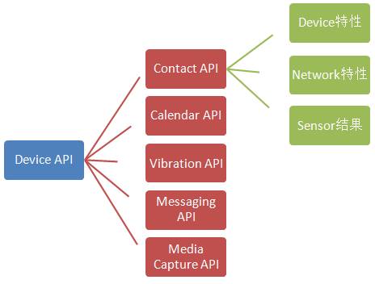

@s
## Canvas入门与拓展
 
author: 崔鹏
 
date: 2015-03-09

@s
## 题要
 
### 一、 背景介绍-HTML5
### 二、 CANVAS简介
### 三、 准备知识：数学知识&物理原理
### 四、 入门：基础API编程
### 五、 扩展1：Demo示例
### 六、 扩展2：个人小发明
@s
###1-1什么是HTML5？
个人认为，HTML5可以是一个比较广义的概念，代表了当前新形势下的web领域一大波新技术的集合。
我感觉至少包含以下几类技术：

    1.狭义的HTML5。这块包含的技术点比较多，是H5开发大头，也是基础要求。
    2.CSS3。这块包含的技术点比较多，是H5开发大头，也是基础要求。
    3.网络通信，包含http2.0,xmlhttprequest2，webrtc,websocket等最新的通信技术。
    4.多媒体。不用安装插件即可支持播放音视频，同时可与CSS无障碍配合，这块是FLASH无法比拟的。
    5.图形技术（canvas,svg,webgl）,实现2d/3d绘图能力。直接调用opengl es 2.0 api，功能灰常强大。
    6.新的渲染引擎（webkit）与js虚拟机运行原理。
    7.最新java script 6.0语言规范。
    8.本地缓存技术(localstorage,IndexedDB,websql...)。
    9.WEB组件化
@vs
    10.Device API，实现各种人机交互硬件需求，如语音，摄像头，gps等。

        人脸识别demo:http://neave.github.io/face-detection/
        手势识别demo:http://www.webhek.com/misc/gestures-reveal-js
    10.File API，实现对本地文件更高级版的操作。
    11.前端架构，WEBAPP规范，前端性能规范，js模块化规范。
    12.前端工程化实践，如业界比较有名的解决方案有百度fis,grunt等
    13.node编程。使JS具备了本地编程和服务端编程的能力。
    14.多线程webworker。当然这块在浏览器端功能还是比较弱，子线程也不具备访问UI的能力，不过也是一个方向。
    15.等等各种新技术和新思想，等你去发现。
    （注：HTML5作为HTML4的增强，自然也包含了原HTML4的相关技术，但不在此介绍范围内）。

@s
###1-2发展情况

简要用百度新闻搜索了几条相关文章，摘录如下：

    Google今起将自动转换Flash广告为HTML5版本

    YouTube视频将默认使用HTML5迁移Flash技术

    Apple 给第三方厂商开放了自己的 js 加速引擎 Nitro，以强化 iOS 设备上 HTML5 的表现。

    得益于WEB优良的跨平台性，很多电视，车载系统，家用电器等嵌入式领域也在用HTML5技术开发实现，如海信在SINOCES2013展出HTML5概念电视,KT（韩国电信）实现了基于HTML5的智能IPTV等。系统只需要支持WEB技术，就能够轻易运行众多WEB应用，企业成本降低了很多，而且方案足够简单。

    大量的HTML5游戏涌现，如神经猫一款小游戏短时间内就聚集了大量人气。同时越来越多原来用flash技术开发的游戏也转到html5上来。我们知道游戏领域一般对性能和功能要求比较高，H5游戏领域的发展促进H5向更多领域渗透。

    越来越多的BI应用采用HTML5开发， 百度地图API发布HTML5矢量地图渲染引擎；。。。等等

因为它在跨平台支持技术上的完美表现，加之各种规范的逐步落地，互联网业的领头公司都强调了HTML5技术在下一代产品中的战略地位，积极拥抱HTML5， 对HTML5的支持推到了前所未有的高度。

@s

###1-3展望

移动领域对HTML5的发展起了非常重要的作用，在著名的flash与html5之争事件后，HTML5标准得到了几乎所有智能移动设备的支持，这一情况甚至要好于桌面设备。

随着浏览器的性能越来越好，越来越更加标准规范，js虚拟机性能大幅度提升，这些为HTML5生长提供了肥沃的土壤。同时借助于HTML5赋予了前端越来越来强的能力，越来越多的前端框架和解决方案涌现出来，Html5经历了从火爆，到冷静，到观望，到思考，逐渐变得成熟稳重。

是时候了，同学们，H5正在起航，HTML5正以“润物细无声”的方式被越来越多人接受，乔帮主的预言正在成真。。

@s
###2-1

